# 🔮 Oracle: CTI Agentic RAG

## 📋 Overview

Oracle is a sophisticated Retrieval-Augmented Generation (RAG) system with agent capabilities specifically designed for Cyber Threat Intelligence (CTI) analysis. It combines the power of large language models with specialized knowledge retrieval to provide accurate, contextual, and actionable intelligence for security professionals.

### Key Features

- **🧠 Agentic RAG Architecture**: Uses a reasoning model for analysis, followed by a specialized tool model for final responses
- **🌐 Web-Enhanced Intelligence**: Augments local knowledge with real-time web search results
- **📊 Multi-Database Prioritization**: Intelligently balances between permanent and temporary knowledge bases
- **🔍 Specialized CTI Analysis**: Optimized for cyber cybersecurity domain with IOC extraction capabilities
- **📝 Document Processing**: Handles PDFs, text files, JSON, and website content
- **💻 Intuitive Web Interface**: Clean, minimalistic UI built with Streamlit


## 🏗️ Architecture

Oracle uses a sophisticated architecture that combines multiple components to deliver powerful CTI analysis capabilities:

<div align="center">
  
  <p><em>Oracle's component architecture</em></p>
</div>

## 🚀 Installation

### Prerequisites

- Python 3.11+
- [Conda](https://docs.conda.io/en/latest/) (recommended for environment management)
- [Ollama](https://ollama.ai) (for local model inference)

### Environment Setup

1. **Create and activate a new conda environment:**

```bash
conda create -n oracle-cti python=3.11
conda activate oracle-cti
```

2. **Clone the repository:**

```bash
git clone https://github.com/karmine05/agenticRAG.git
cd agenticRAG
```

3. **Install required packages:**

```bash
python -m pip install -r requirements.txt
pip install 'smolagents[openai]'
```

### Ollama Setup (for Local Inference)

1. **Install Ollama** from [ollama.ai](https://ollama.ai)

2. **Pull the base models:**

```bash
ollama pull huihui_ai/deepseek-r1-abliterated:14b-qwen-distill-q4_K_M
ollama pull qwen2.5:14b-instruct-q4_K_M
ollama pull llama3:8b-instruct-q4_K_M
```

3. **Create custom models with extended context windows:**

```bash
# Create Deepseek model with 64k context - recommended for reasoning
ollama create deepseek-r1:14b-64k-ab -f ollama_models/Deepseek-r1-14b-64k-ab

# Create Qwen model with 64k context - recommended for CTI purpose
ollama create qwen2.5:7b-64k -f ollama_models/Qwen-7b-Instruct-64K

# Create Llama model with 64k context - recommended for general RAG
ollama create llama3:8b-64k -f ollama_models/Llama-3-8b-64k
```

> **Note**: You can also use the provided `rebuild_models.sh` script to create all required models:
> ```bash
> chmod +x rebuild_models.sh
> ./rebuild_models.sh
> ```

## ⚙️ Configuration

Create a `.env` file in the project root with your configuration settings:

### Local Inference with Ollama

```env
# Model Configuration
USE_HUGGINGFACE=no
HUGGINGFACE_API_TOKEN=
REASONING_MODEL_ID=deepseek-r1:14b-64k-ab
TOOL_MODEL_ID=qwen2.5:7b-64k
GENERAL_TOOL_MODEL_ID=llama3:8b-64k
IOC_TOOL_MODEL_ID=qwen2.5:7b-64k

# Web Search Configuration
WEB_SEARCH_ENABLED=true
WEB_SEARCH_MAX_RESULTS=5
WEB_SEARCH_TIMELIMIT=y

# Search Provider Configuration
# Options: duckduckgo, serpapi
SEARCH_PROVIDER=serpapi

# SerpAPI Configuration
# Get your API key from https://serpapi.com/
SERPAPI_KEY=your_serpapi_key_here

# Temporary Database Configuration
# Higher values prioritize temporary database results more
# Default is 2.0, which means permanent database results are weighted twice as much
TEMP_DB_BOOST=2.0
```

### Cloud API with HuggingFace (Alternative)

```env
USE_HUGGINGFACE=yes
HUGGINGFACE_API_TOKEN=your_token_here
REASONING_MODEL_ID=deepseek-r1:14b-64k-ab
TOOL_MODEL_ID=qwen2.5:7b-64k
```

## 📊 Usage

### Admin: Creating Permanent Vector Databases

The `ingest.py` script is used to create permanent vector databases from various data sources:

```bash
python ingest.py
```

This script will:
1. Process all new files in the `data` directory
2. Create or update the vector database in the `chroma_db` directory
3. Prompt for website URLs to process (optional)


#### Data Directory Structure

Place your data files in the `data` directory with the following structure:

```
data/
  ├── pdf_files/
  │   ├── document1.pdf
  │   └── document2.pdf
  ├── text_files/
  │   ├── document3.txt
  │   └── document4.txt
  └── json_files/
      ├── document5.json
      └── document6.json
```

### End-User: Launching the Application

To start the application with optimized settings:

```bash
# Use the provided script
chmod +x start_optimized.sh
./start_optimized.sh

# Or run directly
export OLLAMA_FLASH_ATTENTION=1
python -m streamlit run web_ui.py
```

<div align="center">
  
  <p><em>Oracle's intuitive web interface</em></p>
</div>

## 🖥️ Web UI Features

### Reasoning Optimization

- **Enable Advanced Reasoning**: When enabled, the system uses a specialized reasoning model to analyze information before generating a response.
  - **ON**: Uses structured reasoning with tools, self-reflection, and complex analysis
  - **OFF**: Uses a simpler conversational approach for faster responses

### Model Selection

- **General RAG (llama3:8b-64k)**: Better for general questions and analysis
- **IOC Extraction (qwen2.5:7b-64k)**: Specialized for extracting and analyzing Indicators of Compromise

### Domain Role Selection

- **CTI Analyst**: Standard cyber threat intelligence analysis
- **Senior Security Analyst**: Advanced analysis with expertise in Sysmon, eBPF, Azure Entra ID, etc.

### Website Processing

Process any website to make its content available for questioning:

1. Enter a URL in the "Process Website" section
2. Click "Process Website"
3. Wait for processing to complete
4. Ask questions about the website content

### Web Search

Enable web search to augment responses with real-time information from the internet:

1. Toggle "Enable Web Search" in the sidebar
2. Ask questions that might benefit from current information
3. The system will automatically search the web and incorporate relevant results

### Database Prioritization

After processing a website or enabling web search, you can adjust how much the system prioritizes temporary database results:

- Use the "Temporary DB Boost" slider in the sidebar
- Higher values (2.0-5.0) give more weight to processed website content and web search results
- Lower values (1.0-2.0) balance between permanent and temporary knowledge


## 🔄 Website Processing Workflow

When you process a website through the UI:

1. **Content Extraction**: The application scrapes the website content
2. **Text Processing**: Content is cleaned and chunked into manageable pieces
3. **Vector Embedding**: Chunks are converted to vector representations
4. **Temporary Storage**: Embeddings are stored in a temporary vector database
5. **Prioritized Retrieval**: When you ask questions, the system prioritizes content from processed websites based on the TEMP_DB_BOOST setting


## 🛠️ Troubleshooting

### Ollama Issues

If you encounter issues with Ollama, you can restart the service:

```bash
# Use the provided script
chmod +x restart_ollama.sh
./restart_ollama.sh
```

### Memory Usage

If you experience high memory usage:

1. Close other memory-intensive applications
2. Reduce the number of processed websites in a single session
3. Use the IOC Extraction model, which requires less memory


## 🤝 Contributing

Contributions are welcome! Please feel free to submit a Pull Request.

## 📄 License

This project is licensed under the MIT License - see the LICENSE file for details.
