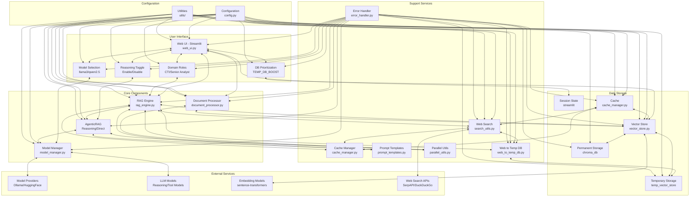

# CTI Agent Architecture Diagram

## Data Flow

1. **User Input Flow**:
   - User submits a query through the Streamlit UI
   - User can select model (llama3:8b-64k or qwen2.5:7b-64k)
   - User can select domain role (CTI Analyst or Senior Security Analyst)
   - User can toggle reasoning mode (on/off)
   - User can adjust TEMP_DB_BOOST for database prioritization
   - Query is processed by the RAG Engine
   - RAG Engine retrieves relevant documents from Vector Store with prioritization based on TEMP_DB_BOOST
   - If web search is enabled, retrieves web search results and adds them to a temporary database
   - Web search results are prioritized based on TEMP_DB_BOOST setting
   - If reasoning is enabled, uses REASONING_MODEL_ID from .env for reasoning and tool model for final answer
   - If reasoning is disabled, uses the selected model directly
   - Response is returned to the UI

2. **Document Processing Flow**:
   - User uploads documents (PDF) or provides website URLs
   - Document Processor extracts and chunks text
   - Vector Store creates embeddings and stores document chunks
   - For website content, chunks are stored in temporary vector store
   - User can adjust TEMP_DB_BOOST to control prioritization between temporary and permanent databases
   - Documents become available for RAG queries with prioritization based on TEMP_DB_BOOST setting

3. **Model Interaction Flow**:
   - User can select between llama3:8b-64k (general RAG) and qwen2.5:7b-64k (better for IOC extraction)
   - User can toggle reasoning mode on/off
   - Model Manager initializes models (local via Ollama or cloud via HuggingFace)
   - When reasoning is ON, uses REASONING_MODEL_ID from .env for reasoning and tool model for final answer
   - When reasoning is OFF, uses the selected model directly
   - RAG Engine creates prompts using Prompt Templates based on selected domain role
   - Model Manager sends prompts to models and receives responses
   - Responses are processed and returned to the user

4. **Caching Mechanism**:
   - Cache Manager stores document retrieval results
   - Cache Manager stores web search results
   - Reduces redundant operations and improves performance

## Key Components

### Core Components
- **Web UI (Streamlit)**: User interface for interacting with the system
  - **Model Selection**: Toggle between llama3:8b-64k (general RAG) and qwen2.5:7b-64k (better for IOC extraction)
  - **Domain Roles**: Toggle between 'cyber_security' (CTI Analyst) and 'senior_security_analyst' (Senior Security Analyst with expertise in Sysmon, eBPF, AzureEntra ID, etc.)
  - **Reasoning Toggle**: Enable/disable AgenticRAG reasoning optimization
  - **DB Prioritization**: Control TEMP_DB_BOOST weight distribution between temporary and permanent databases
- **RAG Engine**: Core component that orchestrates the RAG process
- **AgenticRAG**: Implements reasoning and direct approaches for query processing
  - When Reasoning Toggle is ON, uses REASONING_MODEL_ID from .env as the reasoning model along with the tool model for the final answer
  - When Reasoning Toggle is OFF, uses the selected model directly
- **Model Manager**: Manages model initialization and inference
- **Document Processor**: Processes documents from various sources

### Data Storage
- **Vector Store**: Manages document embeddings and retrieval
- **Permanent Storage**: Persistent ChromaDB for long-term document storage
- **Temporary Storage**: Temporary vector stores for session-specific documents (processed websites and web search results)
  - Prioritized using TEMP_DB_BOOST setting (1.0-5.0) controlled from the UI
  - Web search results are automatically added to temporary storage for better integration
- **Session State**: Streamlit session state for UI state management
- **Cache**: Caching system for improved performance

### Support Services
- **Web Search**: Enhances responses with real-time web information
- **Web to Temp DB**: Converts web search results to temporary vector database entries
- **Cache Manager**: Improves performance through caching
- **Prompt Templates**: Provides customizable prompts for different use cases
- **Parallel Utils**: Enables parallel processing for improved performance
- **Error Handler**: Provides consistent error handling across components

### External Services
- **Model Providers**: Ollama (local) and HuggingFace (cloud) API interfaces
- **LLM Models**:
  - **Reasoning Model**: DeepSeek-r1:14b-64k-ab (when reasoning is enabled)
  - **Tool Models**: llama3:8b-64k (general RAG) and qwen2.5:7b-64k (IOC extraction)
- **Embedding Models**: Vector embedding models for document indexing
- **Web Search APIs**: SerpAPI and DuckDuckGo for real-time web search

### Configuration
- **Configuration**: Centralizes system configuration
- **Utilities**: Common utility functions used across components
